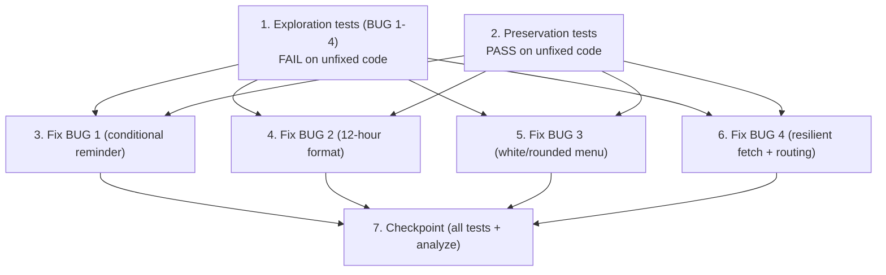

# Implementation Plan

## Overview

This plan follows the exploratory bugfix methodology: first surface counterexamples that demonstrate BUG 1–4 on the UNFIXED code (task 1), then capture the behavior that must be preserved (task 2), then implement each fix with its fix/preservation verification (tasks 3–6), and finally a checkpoint (task 7). Every task references the correctness properties and requirement clauses from `design.md`. `flutter analyze` (target: 0 NEW errors over baseline) is run as verification throughout.

## Tasks

- [x] 1. Write bug-condition exploration tests for all four bugs (BEFORE any fix)
  - **Property 1: Bug Condition** - Four Shift-Request Defects (BUG 1–4)
  - **CRITICAL**: These tests MUST FAIL on the unfixed code — failure confirms each bug exists
  - **DO NOT attempt to fix the tests or the code when they fail** — this task only surfaces counterexamples
  - **NOTE**: These tests encode the expected (post-fix) behavior; they will validate the fixes when they pass after implementation
  - **GOAL**: Surface counterexamples that demonstrate BUG 1, BUG 2, BUG 3 and BUG 4 on the UNFIXED code, confirming the root-cause analysis in design.md
  - **Scoped PBT Approach**: Because these are deterministic UI/logic bugs, scope each property to concrete failing case(s) for reproducibility, then generalize where a pure helper exists (opening-hours parse/compare, label formatter, request-notification classifier)
  - Create the test scaffolding under `test/` (widget + pure-function tests). Since there is no live Supabase DB, inject stub request lists / an injected fetch failure for BUG 4 rendering
  - **BUG 1 (isBugCondition = no timing change OR all changed timings within opening hours):**
    - Case A (unchanged save): save with no shift-timing change → assert the "Update Opening Hours?" reminder IS shown (fails-as-bug; must be no-popup after fix) — _Bug_Condition: `NOT anyTimingChanged(shifts, originalShifts)`_
    - Case B (inside-hours change): opening hours `"6:00 AM – 11:00 PM"`, change a shift to `7:00 AM–1:00 PM` → assert reminder IS shown (fails-as-bug; must be no-popup after fix) — _Bug_Condition: `allChangedTimingsWithin(...)`_
    - Case C (outside-hours change, the correct case): same hours, change a shift to `5:00 AM–1:00 PM` → assert reminder IS shown (this is correct now and after fix; guards against over-suppression)
    - Document counterexample: reminder appears on unchanged / inside-hours saves
  - **BUG 2 (isBugCondition = shift has displayable times):**
    - Dropdown option for `start_time="06:00:00", end_time="12:00:00"` → assert the label contains `06:00:00` (fails-as-bug; after fix must contain `6:00 AM – 12:00 PM` and no `:00:00`)
    - Document counterexample: option label contains raw `HH:mm:ss`
  - **BUG 3 (isBugCondition = menu background ≠ white OR corner radius == 0):**
    - Open the shift-selection dropdown → assert the menu surface is NOT white and/or corners are square (fails-as-bug; after fix white background + corner radius > 0)
    - Document counterexample: dropdown menu is non-white / square
  - **BUG 4 (isBugCondition = any pending requests OR tapped type is a request notification):**
    - List renders: seed a non-empty join list → assert zero cards rendered while the badge shows a positive count (fails-as-bug; after fix rendered card count == list length)
    - Fetch isolation: inject a failing seat-change fetch alongside a healthy join fetch → assert ALL five lists blank on unfixed code (after fix healthy lists still render, failing list shows honest error)
    - Routing: tap a `shift_change_request` notification → assert it lands on `/admin/home` dashboard (fails-as-bug; after fix lands on Reservations → Requests). Also cover `join_request`, `new_join_request`, `seat_change_request`, `hold_request`, `checkin_approval_request`
    - Document counterexamples: lists render 0 items despite a positive count; one embed failure blanks all lists; request notification lands on the dashboard
  - Run all exploration tests on UNFIXED code
  - **EXPECTED OUTCOME**: Tests FAIL (correct — proves the four bugs exist); Case C for BUG 1 passes (correct case)
  - Run `flutter analyze` and confirm the new test files add 0 NEW errors over baseline
  - Mark task complete when tests are written, run, and the failures are documented
  - _Requirements: 1.1, 1.2, 1.3, 1.4, 1.5, 1.6_

- [x] 2. Write preservation property tests (BEFORE implementing any fix)
  - **Property 2: Preservation** - Non-Bug Inputs Unchanged (persistence, send flow, counts, routing, theme)
  - **IMPORTANT**: Follow the observation-first methodology — run the UNFIXED code for non-bug inputs, record actual outputs, then assert those outputs
  - **BUG 1 persistence** (¬C: save proceeds regardless): observe that a save archives removed shifts, guards archive against active memberships, updates/inserts shifts, replicates seat layouts, saves payment settings, and shows the success snackbar (`"Shifts & payment options saved successfully! ✓"`) in the same order → assert unchanged after fix — _Requirements: 3.1, 3.2_
  - **BUG 2/3 send flow** (¬C: shifts with no displayable times still show name; send path untouched): observe the shift-list filtering (other, non-current, non-archived shifts in the same library), the reason field, the insert into `shift_change_requests`, the owner notification, and the honest success message → assert unchanged after fix — _Requirements: 3.3, 3.4_
  - **BUG 4 counts + approve/reject** (¬C: successful fetches, request types NOT in the notification set): observe the correct per-type counts and Join / Seats / Holds / Check-ins / Shifts toggles, and the approve/reject/audit flows → assert unchanged after fix — _Requirements: 3.5, 3.6_
  - **BUG 4 non-request routing** (¬C: `isRequestNotification` false): observe that `payment_submitted`, `check_in`, `daily_summary` etc. route to their existing destination (dashboard) → assert unchanged after fix — _Requirements: 3.7_
  - **Theme**: assert the warm-orange `#E65C00` Material 3 palette (light/dark) is unchanged across the touched widgets — _Requirements: 3.8_
  - **Property-based tests** for the pure helpers (stronger preservation guarantees): random request-notification types → request types classified in-set, others out; random `HH:mm:ss` pairs → label is 12-hour and seconds-free; random request lists → rendered card count equals list length when fetch OK
  - Run all preservation tests on UNFIXED code
  - **EXPECTED OUTCOME**: Tests PASS (confirms the baseline behavior to preserve)
  - Run `flutter analyze` and confirm 0 NEW errors over baseline
  - Mark task complete when tests are written, run, and passing on unfixed code
  - _Requirements: 3.1, 3.2, 3.3, 3.4, 3.5, 3.6, 3.7, 3.8_

- [x] 3. Fix for BUG 1 — conditional "Update Opening Hours?" reminder
  - **File**: `lib/screens/shift_management.dart`

  - [x] 3.1 Implement the conditional opening-hours reminder
    - Snapshot original timings on load: in `_loadData`, after building each `_ShiftModel`, record its id + start/end into a `Map<String, (TimeOfDay, TimeOfDay)>` `_originalTimings` keyed by shift id (new shifts with `id == null` count as changed)
    - Load opening hours: extend the `libraries` select in `_loadData` from `select('social_links')` to `select('social_links, opening_hours')` and store the raw text in `String? _openingHoursRaw`
    - Add a free-text parser `_HoursRange? _parseOpeningHours(String? raw)`: normalize (lowercase, unify en/em dashes + `to`/`till`/`until`); detect all-day forms (`24 hours`, `24/7`, `24x7`, `all day`, `always open`, `open 24`) → all-day range; else extract time tokens `(\d{1,2})(?::(\d{2}))?\s*(am|pm)?` taking FIRST = open, LAST = close; fewer than two tokens → `null`
    - Add `bool _timingWithin(TimeOfDay s, TimeOfDay e, _HoursRange r)`: minutes-since-midnight, add 24h to close/end when crossing midnight, return `open <= start && end <= close`
    - Guard the reminder in `_handleSave` (replace the unconditional call): compute `changed` = new or timing-differs shifts; `shouldRemind` = false when `changed.isEmpty` (Req 2.2), false when all-day, true iff ANY changed shift is NOT `_timingWithin` for a parsed range (Req 2.1 / 2.7), true when unparseable/blank (conservative fallback per design tradeoffs). Only `await _showOpeningHoursReminder();` when `shouldRemind`
    - Leave the rest of the success path (persistence, snackbar, `Navigator.pop(context, true)`) untouched
    - _Bug_Condition: `isBugCondition(input)` = `NOT anyTimingChanged(shifts, originalShifts) OR allChangedTimingsWithin(shifts, originalShifts, openingHours)` (design BUG 1)_
    - _Expected_Behavior: no popup when unchanged or all changed timings within hours; popup only when a changed timing falls outside opening hours (Correctness Property 1)_
    - _Preservation: BUG 1 Preservation Requirements — archive/guard/update/insert/seat-replicate/payment-save/success-snackbar order unchanged_
    - _Requirements: 2.1, 2.2, 2.7, 3.1, 3.2_

  - [x] 3.2 Verify BUG 1 exploration test now passes
    - **Property 1: Expected Behavior** - Opening-hours reminder only for out-of-hours timing changes
    - **IMPORTANT**: Re-run the SAME BUG 1 cases from task 1 — do NOT write new tests
    - **EXPECTED OUTCOME**: Case A (unchanged) and Case B (inside-hours) now show NO popup; Case C (outside-hours) still shows the popup
    - _Requirements: 2.1, 2.2, 2.7_

  - [x] 3.3 Verify BUG 1 preservation tests still pass
    - **Property 2: Preservation** - Shift/payment persistence unchanged
    - **IMPORTANT**: Re-run the SAME persistence tests from task 2 — do NOT write new tests
    - **EXPECTED OUTCOME**: Persistence, archive, seat replication, payment save and success snackbar unchanged
    - Run `flutter analyze` — target 0 NEW errors over baseline
    - _Requirements: 3.1, 3.2, 3.8_

- [x] 4. Fix for BUG 2 — 12-hour shift-change option formatting
  - **File**: `lib/screens/member_home.dart`

  - [x] 4.1 Reuse the existing 12-hour formatter for the dropdown label
    - In `_openShiftChangeRequestSheet`, replace the raw-string label (`'  ($st–$en)'` from `start_time`/`end_time`) with the existing `_formatShiftRange(s)` helper (returns `"6:00 AM – 12:00 PM"`, collapses gracefully when a time is missing)
    - Compose the label as `'${s['name']}  ($range)'` when `range` is non-empty and not `—`, else just the shift name. Introduce NO new helper (reuse mandate)
    - _Bug_Condition: `isBugCondition(input)` = `hasValidTimes(input.start_time, input.end_time)` (design BUG 2)_
    - _Expected_Behavior: label renders 12-hour AM/PM with no seconds (Correctness Property 2)_
    - _Preservation: BUG 2/3 send flow unchanged — shift-list filtering, reason field, insert, owner notification, success message_
    - _Requirements: 2.3, 3.3, 3.4_

  - [x] 4.2 Verify BUG 2 exploration test now passes
    - **Property 1: Expected Behavior** - 12-hour shift-change option formatting
    - **IMPORTANT**: Re-run the SAME BUG 2 case from task 1 — do NOT write a new test
    - **EXPECTED OUTCOME**: label for `06:00:00–12:00:00` now contains `6:00 AM – 12:00 PM` and no `:00:00`
    - _Requirements: 2.3_

  - [x] 4.3 Verify BUG 2 preservation tests still pass
    - **Property 2: Preservation** - Shift-change send flow unchanged
    - **IMPORTANT**: Re-run the SAME send-flow tests from task 2 — do NOT write new tests
    - **EXPECTED OUTCOME**: filtering, reason field, insert, owner notification and success message unchanged; shifts with no displayable times still show their name
    - Run `flutter analyze` — target 0 NEW errors over baseline
    - _Requirements: 3.3, 3.4, 3.8_

- [x] 5. Fix for BUG 3 — white, rounded shift-selection menu
  - **File**: `lib/screens/member_home.dart`

  - [x] 5.1 Style the shift-selection dropdown white with curved corners
    - On the `DropdownButtonFormField<String>` in `_openShiftChangeRequestSheet`, set `dropdownColor: Colors.white` and `borderRadius: BorderRadius.circular(12)` so the opened menu is white with curved corners
    - Round the field's own border via `OutlineInputBorder(borderRadius: BorderRadius.circular(12))` on `border`/`enabledBorder`/`focusedBorder`, keeping the warm-orange (`#E65C00`) focus accent. Do not change layout or accent hierarchy
    - _Bug_Condition: `isBugCondition(input)` = `selectionMenuBackground != white OR selectionMenuCornerRadius == 0` (design BUG 3)_
    - _Expected_Behavior: white background with corner radius > 0, warm-orange M3 accent preserved (Correctness Property 3)_
    - _Preservation: theme + send flow unchanged (Req 3.8, 3.3, 3.4)_
    - _Requirements: 2.4, 3.8_

  - [x] 5.2 Verify BUG 3 exploration test now passes
    - **Property 1: Expected Behavior** - Shift selection popup styling
    - **IMPORTANT**: Re-run the SAME BUG 3 case from task 1 — do NOT write a new test
    - **EXPECTED OUTCOME**: menu background == white AND corner radius > 0
    - _Requirements: 2.4_

  - [x] 5.3 Verify BUG 3 preservation tests still pass
    - **Property 2: Preservation** - Warm-orange M3 theme unchanged
    - **IMPORTANT**: Re-run the SAME theme tests from task 2 — do NOT write new tests
    - **EXPECTED OUTCOME**: warm-orange `#E65C00` palette and accent hierarchy unchanged across the touched widgets
    - Run `flutter analyze` — target 0 NEW errors over baseline
    - _Requirements: 2.4, 3.8_

- [x] 6. Fix for BUG 4 — resilient fetch + honest states + notification routing
  - **Files**: `lib/screens/reservations/requests_sub_tab.dart`, `lib/services/notification_service.dart`, `lib/core/active_library_store.dart`, `lib/screens/notifications_screen.dart`, `lib/services/push_notification_service.dart`, `lib/screens/admin_home.dart`

  - [x] 6.1 Isolate each fetch and add honest per-type states
    - In `_fetchRequests` (`requests_sub_tab.dart`), wrap each of the join, seat-change, hold, and check-in selects in its OWN `try/catch` (mirroring the existing `shift_change_requests` block) so one failing embed cannot blank the others; track per-type failure booleans (e.g. `_joinLoadFailed`, ...)
    - Harden the embeds: verify each embed hint against the schema and disambiguate explicitly — `seat_change_requests` has two FKs to `seats` (`current_seat_id`, `new_seat_id`); keep the `alias:fk_column(...)` disambiguation and confirm FK names. If an embed still cannot resolve, fall back to a plain column `select()` plus a small keyed label lookup so the list still renders honest data
    - Honest states: when a type's fetch fails, render an error/retry tile for that tab instead of "No pending X" (the empty state must only show when the fetch succeeded AND the list is genuinely empty)
    - _Bug_Condition: `anyPendingRequests(pendingCountByType)` — list must render items (design BUG 4)_
    - _Expected_Behavior: rendered card count == pending count for each successfully-fetched type; failing type shows honest error, not empty state (Correctness Property 4)_
    - _Preservation: per-type counts, approve/reject/audit flows unchanged (Req 3.5, 3.6)_
    - _Requirements: 2.5, 3.5, 3.6_

  - [x] 6.2 Route request-type notifications to the Requests sub-tab
    - In `notification_service.dart` `routeForType`, keep request-type notifications on the admin shell but target the Requests sub-tab; add the missing `shift_change_request` case to the admin group
    - In `active_library_store.dart`, add a consumed-then-nulled navigation intent `ValueNotifier<String?> adminDestinationRequest` (mirroring the existing `switchRequest` pattern); `'requests'` means "open Reservations → Requests"
    - In `notifications_screen.dart` (`_onTapNotification`) and `push_notification_service.dart` (deep-link tap handler): when the tapped `type` is in the request-notification set (`join_request`, `new_join_request`, `seat_change_request`, `shift_change_request`, `hold_request`, `checkin_approval_request`), set `adminDestinationRequest.value = 'requests'` (plus the existing `ActiveLibraryStore.requestSwitch(libId)` when `library_id` is present), then navigate to `/admin/home`. Non-request types untouched
    - In `admin_home.dart` `initState`, add a listener on `adminDestinationRequest` (like `_onExternalSwitchRequest`) that calls the EXISTING `_navigateToReservationsRequestsTab()` on a `'requests'` value then nulls the notifier; remove the listener in `dispose`. When both a library switch and a requests intent are pending, apply the library switch first, then the sub-tab jump
    - _Bug_Condition: `isRequestNotification(tappedNotificationType)` — tap must land on Requests (design BUG 4)_
    - _Expected_Behavior: request-type notification taps land on Reservations → Requests (Correctness Property 4)_
    - _Preservation: non-request notifications route to their existing destinations (Req 3.7)_
    - _Requirements: 2.6, 3.7_

  - [x] 6.3 Verify BUG 4 exploration tests now pass
    - **Property 1: Expected Behavior** - Requests list renders + notification routes to Requests
    - **IMPORTANT**: Re-run the SAME BUG 4 tests from task 1 — do NOT write new tests
    - **EXPECTED OUTCOME**: rendered card count == list length for a healthy fetch; a healthy list still renders when another embed fails (failing list shows honest error); request-type notification taps land on Reservations → Requests
    - _Requirements: 2.5, 2.6_

  - [x] 6.4 Verify BUG 4 preservation tests still pass
    - **Property 2: Preservation** - Counts, approve/reject, and non-request routing unchanged
    - **IMPORTANT**: Re-run the SAME preservation tests from task 2 — do NOT write new tests
    - **EXPECTED OUTCOME**: per-type counts and toggles unchanged; approve/reject/audit flows unchanged; non-request notifications (`payment_submitted`, `check_in`, `daily_summary`, ...) still route to the dashboard
    - Run `flutter analyze` — target 0 NEW errors over baseline
    - _Requirements: 3.5, 3.6, 3.7, 3.8_

- [x] 7. Checkpoint — ensure all tests pass and analyzer is clean
  - Run the full test suite: all exploration tests from task 1 now PASS (they encoded expected behavior); all preservation tests from task 2 still PASS (no regressions)
  - Run `flutter analyze` — confirm 0 NEW errors/warnings over the established baseline (pre-existing noise like `withOpacity`, `use_build_context_synchronously`, `avoid_print`, unused imports is BASELINE — do NOT "fix" it)
  - Confirm no dishonest UI was introduced and the warm-orange `#E65C00` Material 3 theme is intact across all four touched screens
  - Ask the user if any questions arise
  - _Requirements: 2.1, 2.2, 2.3, 2.4, 2.5, 2.6, 2.7, 3.1, 3.2, 3.3, 3.4, 3.5, 3.6, 3.7, 3.8_

## Task Dependency Graph



Tasks 1 and 2 must complete first (tests written and run on unfixed code). Fixes 3–6 are independent of each other and may proceed in any order, each re-running its own exploration and preservation checks. Task 7 depends on all fixes.

```json
{
  "waves": [
    { "wave": 1, "tasks": ["1", "2"], "dependsOn": [] },
    { "wave": 2, "tasks": ["3", "4", "5", "6"], "dependsOn": ["1", "2"] },
    { "wave": 3, "tasks": ["7"], "dependsOn": ["3", "4", "5", "6"] }
  ]
}
```

## Notes

- **Test-first / observation-first**: task 1 tests MUST FAIL on unfixed code (proves the bugs); task 2 tests MUST PASS on unfixed code (records the baseline to preserve). Do not write fixes until both are done.
- **No live Supabase DB**: BUG 4 rendering/fetch behavior is validated with widget tests using stubbed request lists and an injected fetch failure. Pure helpers (opening-hours parse/compare, label formatter, request-notification classifier) get unit + property-based tests.
- **Golden rules**: no dishonest UI, keep the warm-orange `#E65C00` Material 3 style (refine, don't redesign), existing codebase is the source of truth, no server tier / no new RPC.
- **Analyzer baseline**: `flutter analyze` target is 0 NEW errors. Pre-existing noise (`withOpacity`, `use_build_context_synchronously`, `avoid_print`, unused imports at HEAD) is BASELINE — do not "fix" it.
- **BUG 1 tradeoff**: unparseable/blank `opening_hours` falls back to prompting whenever a timing changed (false-positive reminder preferred over a silent drift). This fallback is asserted in tests so it is intentional.
