# Pre-Production Technical Audit Report — SILENCE (v6.0)

> **Prepared for:** Launch Readiness Evaluation  
> **Environment:** Windows (`C:\Users\kumar\combined\SILENCE_V6`)  
> **Source of Truth:** Source Code and Active Database Schema  

---

## Executive Summary & Readiness Scores

This report presents a comprehensive, critical technical audit of the **SILENCE** codebase and database schema before public production launch. The application has been evaluated across eight key dimensions, based on a rigorous analysis of the active Dart files and the canonical `supabase_schema.sql` file.

### Readiness Dashboard

```mermaid
gantt
    title launch readiness score (0-100)
    dateFormat  X
    axisFormat %s
    section Metrics
    Security (RLS & Privacy)      : active, 0, 45
    Performance & Bandwidth       : active, 0, 52
    Scalability & Architecture    : active, 0, 55
    Code Quality & Maintainability : active, 0, 48
    Offline Integrity & Sync       : active, 0, 50
    UI/UX Consistency             : active, 0, 78
    Production Readiness          : active, 0, 50
```



| Dimension | Score | Assessment |
| :--- | :---: | :--- |
| **Security & Privacy** | **45/100** | **CRITICAL RISK:** Major RLS bypass vectors exist in payments, user management, and client-writable statuses. Severe DPDP privacy leak in leaderboard RPC due to silent column omissions. |
| **Performance & Bandwidth** | **52/100** | **UNSTABLE:** Severe over-fetching of entire table rows on dashboard counters and analytics. Lack of server-side pagination for historical lists. |
| **Scalability & Architecture** | **55/100** | **HIGH RISK:** Severe Postgres subscription broadcast storm risk on system-wide updates. Heavy client-side filtering on explore/analytics. |
| **Code Quality & Maintainability** | **48/100** | **TECHNICAL DEBT:** "God files" exceeding 6,600 lines combining queries, layout, and state. 0% automated test coverage. |
| **Offline Integrity & Sync** | **50/100** | **DATA LOSS RISK:** Offline queue checking logic results in state loops and lost check-ins. Aggressive discard policy on sync errors. |
| **UI/UX & Aesthetics** | **78/100** | **STABLE:** Premium Warm Orange (#E65C00) Material 3 style is maintained well. Minor layout overflows on shift cards and list flickers. |
| **Production Readiness** | **50/100** | **NO-GO:** Several critical logic, security, and scalability bottlenecks must be resolved before releasing to real-world users. |

---

## Launch Recommendation: 🛑 GO-NOGO (NO-GO)

**Status: NO-GO.** The application is highly vulnerable to security breaches (such as payment confirmation bypass via direct REST api calls), user privacy violations (leaderboard leaking private study hours due to missing database columns), and immediate system crashes under light load (realtime subscription broadcast storms waking up every connected admin's device).

---

## Top 50 Critical Issues (Ranked by Severity)

### Security, RLS & Privacy Vulnerabilities

1. **Payment Status Confirmation Bypass (RLS Gap)**
   - **File:** [supabase_schema.sql](file:///c:/Users/kumar/combined/SILENCE_V6/silence_app/supabase_schema.sql#L910)
   - **Details:** The RLS policy `"Member insert (upload proof)"` on the `payments` table allows authenticated users to insert rows where `member_id = auth.uid()` without restricting the `status` column. A malicious member can directly bypass the UI and make an HTTP POST request to PostgREST inserting a payment with `status = 'confirmed'`, gaining instant access.
   - **Fix:** Add a CHECK constraint or split status management. Set a trigger forcing all client inserts to default to `status = 'pending'`.

2. **Silent Privacy Column Failure & Public Data Leak (PII Violation)**
   - **File:** [member_privacy_security_screen.dart](file:///c:/Users/kumar/combined/SILENCE_V6/lib/screens/member_privacy_security_screen.dart#L60) & [supabase_schema.sql](file:///c:/Users/kumar/combined/SILENCE_V6/silence_app/supabase_schema.sql#L55)
   - **Details:** The frontend UI selects and updates `show_on_leaderboard`, `show_hours`, and `hide_nickname` on the `users` table. However, these columns **do not exist** in the database schema or migrations. The queries fail silently inside `try-catch` blocks, and the UI displays a fake success snackbar ("Privacy settings updated!"). Because the database does not store these preferences, the `library_leaderboard` RPC continues to expose the names, ranks, and study times of users who explicitly opted out.
   - **Fix:** Write a migration adding these three boolean columns to the `users` table and update the `library_leaderboard` RPC to filter them.

3. **Admin User Profile Takeover via Untenanted SELECT/UPDATE**
   - **File:** [supabase_schema.sql](file:///c:/Users/kumar/combined/SILENCE_V6/silence_app/supabase_schema.sql#L800)
   - **Details:** The RLS policy `"Owner can update their library members"` on the `users` table allows a library owner to run `UPDATE` on the `users` record of any member in their library. Because the policy permits modifying any column, the owner can rewrite the member's `email` or `phone` field, decoupling it from Supabase Auth and locking the student out of their profile.
   - **Fix:** Restrict updates to non-privileged fields (e.g. metadata, full_name, avatar_id) or route through a secure RPC.

4. **Client-Writable Request Status on Seat Changes**
   - **File:** [supabase_schema.sql](file:///c:/Users/kumar/combined/SILENCE_V6/silence_app/supabase_schema.sql#L1020)
   - **Details:** Members can insert/update their own `seat_change_requests`. The policy does not prevent them from setting `status = 'approved'` directly, allowing self-allocation of seats.
   - **Fix:** Enforce `status = 'pending'` on INSERT via a DB trigger or policy `WITH CHECK (status = 'pending')`.

5. **Client-Writable Request Status on Shift Transfers**
   - **File:** [supabase_schema.sql](file:///c:/Users/kumar/combined/SILENCE_V6/silence_app/supabase_schema.sql#L1030)
   - **Details:** Members can write to `shift_change_requests` directly. A malicious user can write `status = 'approved'`, bypassing admin-managed approvals and double-booking shifts.
   - **Fix:** Enforce `status = 'pending'` on database constraints.

6. **Client-Writable Request Status on Membership Holds**
   - **File:** [supabase_schema.sql](file:///c:/Users/kumar/combined/SILENCE_V6/silence_app/supabase_schema.sql#L1040)
   - **Details:** The `hold_requests` table lacks columns restrictions for updates by members, enabling students to pause their membership billing cycles and extend validities without admin approval.
   - **Fix:** Restrict status modifications to admin role checks.

7. **Arbitrary Notification Spoofing & Admin Alert Flooding**
   - **File:** [supabase_schema.sql](file:///c:/Users/kumar/combined/SILENCE_V6/silence_app/supabase_schema.sql#L1100)
   - **Details:** RLS allows inserting records into the `notifications` table for other users. A member can insert notifications targetting the library owner (e.g., spamming critical alerts or fake payment warnings).
   - **Fix:** Enforce policy that restricts inserts to own notifications, or restrict recipient user IDs.

8. **Abuse Report Reporter-ID Spoofing**
   - **File:** [moderation_service.dart](file:///c:/Users/kumar/combined/SILENCE_V6/lib/services/moderation_service.dart#L46)
   - **Details:** RLS insert policy for `abuse_reports` allows inserting any value. A user can file reports under a different `reporter_id` to frame other users.
   - **Fix:** Restrict `reporter_id` insert to `auth.uid()`.

9. **Insecure Storage Uploads with No File Type Enforcement**
   - **File:** [supabase_schema.sql](file:///c:/Users/kumar/combined/SILENCE_V6/silence_app/supabase_schema.sql#L1150)
   - **Details:** The storage bucket RLS policies permit authenticated users to upload files of any extension (including `.exe` or `.html` scripts) to public folders, exposing the host to abuse.
   - **Fix:** Add a MIME-type check to the storage policies.

10. **Insecure Storage Upload Size Limits Missing**
    - **File:** [supabase_schema.sql](file:///c:/Users/kumar/combined/SILENCE_V6/silence_app/supabase_schema.sql#L1160)
    - **Details:** No storage size limits are checked at the database bucket policy level. Users can upload multi-gigabyte files, exhausting the Supabase storage quota.
    - **Fix:** Limit file uploads to `5MB` using storage validation policies.

### Performance, Scalability & Resource Gaps

11. **Realtime Broadcast Storm: System-wide Seats Listening**
    - **File:** [layout_sub_tab.dart](file:///c:/Users/kumar/combined/SILENCE_V6/lib/screens/reservations/layout_sub_tab.dart#L117)
    - **Details:** The realtime channel listens to `public:seats` for all Postgres events. Because it lacks a `library_id` filter (e.g. `library_id=eq.${widget.libraryId}`), EVERY seat update in ANY library in the entire app triggers rebuilds and SELECT queries on ALL connected admin dashboards in India. Under a load of 1,000 active admins, a single seat check-in will trigger 1,000 parallel database queries.
    - **Fix:** Add a specific filter parameter to the channel registration.

12. **Realtime Broadcast Storm: System-wide Requests Listening**
    - **File:** [requests_sub_tab.dart](file:///c:/Users/kumar/combined/SILENCE_V6/lib/screens/reservations/requests_sub_tab.dart#L113)
    - **Details:** Admin listens to `join_requests`, `checkin_approvals`, `shift_change_requests`, and `seat_change_requests` system-wide. Every request change wakes up all admin clients and executes four separate select queries, creating a severe database traffic storm.
    - **Fix:** Tenant-scope all subscription channels with `library_id` filters.

13. **Realtime Broadcast Storm: System-wide Floor & Section Updates**
    - **File:** [layout_sub_tab.dart](file:///c:/Users/kumar/combined/SILENCE_V6/lib/screens/reservations/layout_sub_tab.dart#L131)
    - **Details:** Floors and sections channels are subscribed system-wide without tenant scoping.
    - **Fix:** Filter updates by active library.

14. **Dashboard Operational Feed Memory Over-fetching**
    - **File:** [admin_home.dart](file:///c:/Users/kumar/combined/SILENCE_V6/lib/screens/admin_home.dart#L600)
    - **Details:** To calculate dashboard metrics (active memberships, expired memberships, new members), the client executes `Future.wait` fetching all matching rows, nested objects, and columns, then counts them locally using `.length` in Dart. At scale (1,000+ members), this consumes excessive bandwidth and CPU.
    - **Fix:** Use PostgreSQL aggregate COUNT queries (`count: CountOption.exact`) instead of downloading raw arrays.

15. **Active Library Search Client-side Performance Bottleneck**
    - **File:** [member_explore_screen.dart](file:///c:/Users/kumar/combined/SILENCE_V6/lib/screens/member_explore_screen.dart#L57) & [member_home.dart](file:///c:/Users/kumar/combined/SILENCE_V6/lib/screens/member_home.dart#L307)
    - **Details:** The app queries ALL active libraries in India on app load and explore load, then runs search filters (city, name, code) and sorting client-side in Dart. As library counts increase, this will crash lower-end mobile devices due to JSON parsing memory exhaustion.
    - **Fix:** Implement server-side search using PostgREST filters (`ilike`, `eq`) and limit/offsets.

16. **Admin Analytics Memory Exhaustion (Payments over-fetching)**
    - **File:** [admin_analytics_tab.dart](file:///c:/Users/kumar/combined/SILENCE_V6/lib/screens/admin_analytics_tab.dart#L538)
    - **Details:** The analytics panel selects all historical payments for the selected time range (e.g. 1 year) with deeply nested objects (`memberships(*)`, `shifts(*)`, `member_id(*)`) and groups them in-memory in Dart.
    - **Fix:** Create a Postgres view or RPC to retrieve aggregated financial summaries directly.

17. **Admin Analytics Memory Exhaustion (Memberships over-fetching)**
    - **File:** [admin_analytics_tab.dart](file:///c:/Users/kumar/combined/SILENCE_V6/lib/screens/admin_analytics_tab.dart#L555)
    - **Details:** Fetches all library memberships with nested data.
    - **Fix:** Aggregate memberships counts on the server or write an RPC.

18. **Admin Analytics Memory Exhaustion (Attendance over-fetching)**
    - **File:** [admin_analytics_tab.dart](file:///c:/Users/kumar/combined/SILENCE_V6/lib/screens/admin_analytics_tab.dart#L559)
    - **Details:** Fetches every single attendance record for a selected range with nested columns. Under high daily traffic, this will exceed REST payload limits and timeout.
    - **Fix:** Paginate or fetch pre-aggregated statistics.

19. **Unpaginated Attendance History on Member Profile**
    - **File:** [member_history_tab.dart](file:///c:/Users/kumar/combined/SILENCE_V6/lib/screens/member_history_tab.dart#L80)
    - **Details:** Member attendance history is loaded via a single query fetching all historical records. There is no pagination or lazy loading.
    - **Fix:** Implement cursor or range-based pagination.

20. **Unpaginated Payment History on Member Profile**
    - **File:** [member_history_tab.dart](file:///c:/Users/kumar/combined/SILENCE_V6/lib/screens/member_history_tab.dart#L120)
    - **Details:** Entire payment history is loaded in one go.
    - **Fix:** Implement pagination.

21. **In-Memory PDF Compilation Memory Crashes (OOM)**
    - **File:** [pdf_exporter.dart](file:///c:/Users/kumar/combined/SILENCE_V6/lib/utils/pdf_exporter.dart#L341)
    - **Details:** The PDF exporter constructs documents (e.g., member directory) entirely in-memory using `pdf.save()`. Generating documents with thousands of rows will crash the Android JVM.
    - **Fix:** Limit export size or process PDF generation in chunks.

22. **Profile Photos Flicker & Bandwidth Waste (Uncached Network Images)**
    - **File:** [admin_home.dart](file:///c:/Users/kumar/combined/SILENCE_V6/lib/screens/admin_home.dart#L4556)
    - **Details:** Admin dashboard attendance strip loads photos via standard `Image.network`. This causes constant image re-downloads during list scrolling and layout updates.
    - **Fix:** Replace all occurrences of `Image.network` with `CachedNetworkImage` from the `cached_network_image` package.

23. **Lack of Expression Index for Local Timezone Date in Rollup**
    - **File:** [supabase_schema.sql](file:///c:/Users/kumar/combined/SILENCE_V6/silence_app/supabase_schema.sql#L1544)
    - **Details:** The attendance rollup function checks `(a.check_in_time AT TIME ZONE 'Asia/Kolkata')::date = p_date`. Because the database index is on the raw `check_in_time` timestamp, this date expression requires a full sequential scan of attendance records.
    - **Fix:** Create a functional index on the localized date: `CREATE INDEX ON attendance (((check_in_time AT TIME ZONE 'Asia/Kolkata')::date));`

24. **Excessive Home Screen Re-querying via Debounce Trigger**
    - **File:** [member_home.dart](file:///c:/Users/kumar/combined/SILENCE_V6/lib/screens/member_home.dart#L152)
    - **Details:** Realtime changes on memberships, attendance, or notifications trigger `_loadInitialData` (fetching 8 parallel futures) with only a 700ms debounce. If notifications trigger rapidly, the app enters an infinite fetch loop.
    - **Fix:** Split data loading into independent widgets so notification changes only fetch notification lists.

25. **Missing Index on Audit Log Action & Category**
    - **File:** [supabase_schema.sql](file:///c:/Users/kumar/combined/SILENCE_V6/silence_app/supabase_schema.sql#L650)
    - **Details:** No database index exists on the `category` column of the `audit_log` table, making category filtering slow as audit logs grow.
    - **Fix:** Add index `idx_audit_log_category` on `audit_log(category)`.

### Offline Sync & Data Integrity Risks

26. **Offline Scanner State Loop & Infinite Checkouts**
    - **File:** [qr_scanner_screen.dart](file:///c:/Users/kumar/combined/SILENCE_V6/lib/screens/reservations/qr_scanner_screen.dart#L234)
    - **Details:** The offline scanner queries if *any* `synced = 0` check-in row exists in the queue to decide if the current scan type should be a checkout. If a member scans to check in, a `checkin` is queued. If they scan to check out (or scan again the next day), the code still finds that original unsynced `checkin` in the database, resulting in the scanner writing another `checkout` row. The queue accumulates multiple `checkout` rows, and all subsequent scans are marked as `checkout` until the device connects online.
    - **Fix:** Query only the *latest* queued scan for the user in SQLite to determine current state.

27. **Queued Scans Data Loss on Sync Errors**
    - **File:** [offline_sync.dart](file:///c:/Users/kumar/combined/SILENCE_V6/lib/core/offline_sync.dart#L90)
    - **Details:** In the sync function, if an offline scan fails to sync 3 times (due to server errors, connection timeouts, or database transaction locks), the scan is permanently deleted from SQFlite (`db.delete('offline_scan_queue')`). This leads to silent, permanent loss of member attendance data.
    - **Fix:** Keep failing scans in the queue and flag them as `failed_sync` instead of deleting them.

28. **Device System Clock Vulnerability in Offline Scans**
    - **File:** [qr_scanner_screen.dart](file:///c:/Users/kumar/combined/SILENCE_V6/lib/screens/reservations/qr_scanner_screen.dart#L243)
    - **Details:** Offline scans record `DateTime.now().toIso8601String()` based on the user's device system clock. If a student's phone has an incorrect time, it inserts invalid check-in/out timestamps.
    - **Fix:** Cross-verify timestamps or reject timestamps that deviate too far from realistic limits.

29. **Sync Execution Racing on Multi-device Admin Logins**
    - **File:** [offline_sync.dart](file:///c:/Users/kumar/combined/SILENCE_V6/lib/core/offline_sync.dart#L35)
    - **Details:** If multiple admin devices are offline and sync simultaneously on connection recovery, there is no optimistic locking or row locking, risking duplicate check-ins.
    - **Fix:** Use transaction controls on sync queries.

30. **Orphaned Seats DB Bloat on Shift archiving**
    - **File:** [supabase_schema.sql](file:///c:/Users/kumar/combined/SILENCE_V6/silence_app/supabase_schema.sql#L190)
    - **Details:** When a shift is archived, seats associated with that shift are left orphaned in the database rather than released or swept.
    - **Fix:** Add cascading updates/triggers to clear associated seat mappings.

### Architecture, Code Quality & Maintainability Issues

31. **God Screen Anti-pattern (member_home.dart)**
    - **File:** [member_home.dart](file:///c:/Users/kumar/combined/SILENCE_V6/lib/screens/member_home.dart)
    - **Details:** File is **6,684 lines long**, combining all logic for initial loadings, navigation routes, offline scanning wrappers, realtime subscriptions, notifications updates, and modal sheet builders. This is extremely difficult to test, maintain, or debug.
    - **Fix:** Refactor into sub-widgets, separate UI from data fetching services.

32. **God Screen Anti-pattern (admin_analytics_tab.dart)**
    - **File:** [admin_analytics_tab.dart](file:///c:/Users/kumar/combined/SILENCE_V6/lib/screens/admin_analytics_tab.dart)
    - **Details:** File is **4,548 lines long**, containing inline SQL mapping, charts, Excel exports, and complex state changes.
    - **Fix:** Extract data fetching to services and chart rendering to isolated widgets.

33. **God Screen Anti-pattern (layout_sub_tab.dart)**
    - **File:** [layout_sub_tab.dart](file:///c:/Users/kumar/combined/SILENCE_V6/lib/screens/reservations/layout_sub_tab.dart)
    - **Details:** File is **5,045 lines long**, housing seat grids, floor layouts, shifts selectors, and three separate realtime subscriptions.
    - **Fix:** Extract layout editor, seat grids, and realtime setups into standalone files.

34. **Fat Client Architecture & Database Coupling**
    - **File:** Throughout the `lib/screens/` directory (e.g. [admin_home.dart](file:///c:/Users/kumar/combined/SILENCE_V6/lib/screens/admin_home.dart), [member_home.dart](file:///c:/Users/kumar/combined/SILENCE_V6/lib/screens/member_home.dart))
    - **Details:** Raw Supabase REST queries are embedded directly in Dart UI code. This makes it impossible to switch database backends, run offline mocks, or write unit tests.
    - **Fix:** Abstract all database queries behind Repository or Service classes.

35. **0% Automated Test Coverage**
    - **Details:** The codebase has virtually zero unit tests, integration tests, or widget tests, leaving critical business paths (payments, check-ins, shift transfers) completely unverified.
    - **Fix:** Write tests for the core services and database RPCs.

36. **Supabase Configurations Hardcoding**
    - **File:** [supabase_config.dart](file:///c:/Users/kumar/combined/SILENCE_V6/lib/core/supabase_config.dart)
    - **Details:** Project URLs, client IDs, and keys are hardcoded. Changing environments requires manually rewriting the files.
    - **Fix:** Extract configs to environment variables (`--dart-define`).

37. **Hardcoded Payment Tiers in UI**
    - **File:** [subscription_screen.dart](file:///c:/Users/kumar/combined/SILENCE_V6/lib/screens/subscription_screen.dart)
    - **Details:** Subscription plans (Free, ₹499, ₹799) are hardcoded in the frontend, preventing dynamic price updates from the server.
    - **Fix:** Query subscription plans dynamically from Supabase database or a config service.

38. **Unused / Dead Code (Beta mode gating)**
    - **File:** [plan_service.dart](file:///c:/Users/kumar/combined/SILENCE_V6/lib/core/plan_service.dart#L44)
    - **Details:** `betaMode = true` gates are hardcoded, bypassing plan validations. The subscription billing checks remain dormant, making them vulnerable to regression.
    - **Fix:** Establish a remote config flag instead of compiling hardcoded booleans.

39. **DateTime Timezone Inconsistency in Operations Feed**
    - **File:** [admin_home.dart](file:///c:/Users/kumar/combined/SILENCE_V6/lib/screens/admin_home.dart#L815)
    - **Details:** `_loadOperationalFeeds` uses `DateTime.now()` (device local time) instead of `istNow()`, causing boundaries desync for admins operating on foreign-configured devices.
    - **Fix:** Force all calculations to use the project's `istNow()`.

40. **Unchecked Null Assertions on Database Result Parsing**
    - **File:** Throughout the codebase.
    - **Details:** The code uses bang operators (`!`) on database JSON fields (e.g. `row['amount']!`), which will crash the app if a column is ever null in the database.
    - **Fix:** Replace bang assertions with safe null-coalescing.

### UI/UX & Layout Overflow Flaws

41. **Shift Card Layout Overflow**
    - **File:** [admin_home.dart](file:///c:/Users/kumar/combined/SILENCE_V6/lib/screens/admin_home.dart)
    - **Details:** Text overflows on shifts list cards when shift names or times are long.
    - **Fix:** Wrap widgets in `Flexible` or `Expanded` constraints.

42. **Splash Screen Freezes on Socket Timeouts**
    - **File:** [splash_screen.dart](file:///c:/Users/kumar/combined/SILENCE_V6/lib/screens/splash_screen.dart#L84)
    - **Details:** If connection times out on startup, the splash screen displays a connection failed state, but has no manual reload button.
    - **Fix:** Add a "Retry Connection" button to the Splash UI.

43. **Audit Log Inaccessibility**
    - **File:** [audit_log_screen.dart](file:///c:/Users/kumar/combined/SILENCE_V6/lib/screens/audit_log_screen.dart#L54)
    - **Details:** Hard limits audit entries to 40 items with no "Load More" action.
    - **Fix:** Implement a "Load More" button or infinite scroll.

44. **No Seat Filter Slow Updates**
    - **File:** [members_sub_tab.dart](file:///c:/Users/kumar/combined/SILENCE_V6/lib/screens/reservations/members_sub_tab.dart)
    - **Details:** The "No Seat" filter does not update automatically when an admin assigns a seat, requiring a manual swipe-refresh.
    - **Fix:** Update local UI state immediately on seat allocation success.

45. **Manual Check-in Notification Decoupling**
    - **Details:** Admin manual check-in sends notifications but doesn't handle navigation routing correctly when tapped on the member side.
    - **Fix:** Map payload routes explicitly in FCM handlers.

46. **FCM Registration Silent Failures**
    - **Details:** If Firebase registration fails on the device, it fails silently, preventing the user from knowing they won't receive check-in alerts.
    - **Fix:** Add error logging and user notification on registration errors.

47. **Inconsistent UI Color Scheme in Dark Mode**
    - **Details:** Dark mode uses generic dark grey (#121212) instead of brand-tinted slate, breaking style consistency.
    - **Fix:** Update dark theme definitions in `app_palette.dart`.

48. **Double-Click Form Submission in Query Composer**
    - **File:** [contact_admin_screen.dart](file:///c:/Users/kumar/combined/SILENCE_V6/lib/screens/contact_admin_screen.dart#L187)
    - **Details:** Submit button does not disable instantly on tap, allowing double-submissions.
    - **Fix:** Disable button immediately inside `setState`.

49. **Mock Payment Proof Upload Visual Desync**
    - **Details:** Member payment proof card shows successful upload locally before the Supabase storage upload finishes.
    - **Fix:** Show a loading progress indicator during file upload.

50. **Missing Internet Connection Banner**
    - **Details:** If connection is lost during active app usage, the app does not show a global banner, leading to failed REST writes.
    - **Fix:** Integrate a connectivity listener showing a top-level offline status banner.

---

## Top 50 High Priority Improvements

1. **Implement Repository Pattern:** Separate data fetching logic from all screens to reduce technical debt.
2. **Add Functional Indexes on Localized Date:** Boost Postgres query execution on daily rollup functions.
3. **Optimistic UI Updates for Seat Allocations:** Re-render layout grid immediately upon assignment.
4. **Implement Global Connectivity Banner:** Inform users when connection state changes.
5. **Enforce Database-level `reporter_id` validation:** Lock reporter ID field to `auth.uid()`.
6. **Limit Image Upload File Sizes:** Limit avatar and cover photo sizes in Storage policies.
7. **Add Search Index on Library Codes:** Speed up member joins via code searches.
8. **Paginate History Tabs:** Apply range selection to avoid out-of-memory errors on long accounts.
9. **Implement Debounced Search in Explore:** Avoid triggering queries on every keystroke.
10. **Sanitize PDF File Names:** Ensure library names do not contain filesystem-restricted characters.
11. **FCM Token Rotation:** Clean up expired push tokens from the database.
12. **Introduce Audit Log Pagination:** Enable admins to browse all historical logs.
13. **Local DB Auto-cleanup:** Flush synced SQLite queue items older than 30 days.
14. **Use SVG Icons for Standard Amenities:** Reduce overall application asset bundle sizes.
15. **Standardize Font Fallbacks:** Prevent text styling glitches if Google Fonts download fails.
16. **Dynamic Theme Controller:** Refactor theme mode storage to avoid local SharedPreferences desync.
17. **Introduce DB-level payment proof checks:** Require URL formatting on `proof_url` inserts.
18. **Add Toast Alerts for Background Sync Success:** Inform user when offline queues sync.
19. **Lock privileged columns in DB RLS:** Ensure subscription and verification columns are unwriteable.
20. **Use postgres SQL logic for age constraints:** Enforce age limits in DB instead of client-side.
21. **Standardize Error Messages:** Extract hardcoded network alerts to a single translation file.
22. **Implement Seat Change Request RLS:** Prevent students from updating other students' requests.
23. **Auto-logout on deletion schedule recovery denial:** Wipe local cached storage if recovery is rejected.
24. **Enforce unique referrals:** Add database unique checks to `referral_code` column.
25. **Sanitize user inputs:** Trim white spaces and remove special characters from usernames.
26. **Optimize dashboard counts:** Write a database RPC returning counting stats.
27. **Avoid nested futures wait on member home:** Load panels sequentially or cache results.
28. **Prevent infinite scroll rebuilds:** Save screen scroll offsets on tab changes.
29. **Verify profile picture MIME types:** Enforce JPG/PNG on user avatars.
30. **Implement retry controls on sync errors:** Limit offline sync retries.
31. **Unify Date Range Selectors:** Refactor calendar bottom sheets to use a single UI widget.
32. **Index expired memberships:** Add B-tree index on memberships `status` and `end_date`.
33. **Add loading states to settings screens:** Prevent clicking actions during updates.
34. **Use transactional DB queries on Join Requests:** Bundle seat and request changes.
35. **Add tooltips to M3 cards:** Help new admins understand seat allocations.
36. **Prevent screen rotation issues:** Force layout orientations to portrait.
37. **Validate UPI addresses:** Validate payment handle formats before saving.
38. **Graceful FCM permission rejections:** Avoid logs spamming when permissions are denied.
39. **Standardize splash screen loaders:** Use standard orange CircularProgressIndicators.
40. **Use safe type castings:** Replace `as Map` with type check assertions.
41. **Cache active library details:** Store active library settings locally to reduce fetches.
42. **Implement rate limits on RPC calls:** Limit database hits on leaderboard queries.
43. **Clean up orphaned memberships records:** Delete test accounts regularly.
44. **Handle database timeout exceptions:** Show friendly timeout alerts instead of generic errors.
45. **Optimize PDF zebra coloring:** Use CSS-like styles for PDF tables.
46. **Optimize PNG assets size:** Compress png assets inside `assets/images/`.
47. **Log security events:** Send critical failures to audit logs.
48. **Verify timezone boundaries:** Add units tests to verify timezone offsets.
49. **Enforce gender enums:** Validate gender bounds inside the database.
50. **Implement automated code styling checks:** Enforce Dart styling rules during CI/CD.

---

## Technical Debt & Architecture Report

### File Size Inventory (Critical Bloat)

```
member_home.dart           ████████████████████████████████ 6,684 lines
layout_sub_tab.dart        ████████████████████████ 5,045 lines
admin_analytics_tab.dart   ████████████████████ 4,548 lines
requests_sub_tab.dart      ████████████ 2,555 lines
members_sub_tab.dart       ██████████ 2,074 lines
```

### Architectural Deficiencies
- **Zero Decoupling (Fat Client):** The UI layer communicates directly with Supabase via REST. Business logic, routing, and DB operations are mixed together.
- **Realtime Connection Waste:** Unfiltered subscriptions cause high server load and duplicate queries.
- **Mock State Creep:** Mock billing is mixed with production code.

---

## Scalability Bottlenecks & 100K User Readiness

Under 100,000 active users:
- **Database Crash:** Realtime updates to `seats` and `join_requests` will trigger a storm of SELECT queries.
- **REST Limit Exhaustion:** Analytics tabs fetching raw tables will cause timeout errors and memory crashes.
- **Bandwidth Storm:** explore lists loading all active libraries in India will download megabytes of photos and data per user.

---

## Launch Checklist & Action Plan

```
[ ] Step 1: Write migration for users privacy columns (show_on_leaderboard, show_hours, hide_nickname).
[ ] Step 2: Tenant-scope realtime subscriptions in layout_sub_tab.dart and requests_sub_tab.dart.
[ ] Step 3: Implement database triggers forcing status = 'pending' on client inserts.
[ ] Step 4: Fix the offline scanner state loop in qr_scanner_screen.dart.
[ ] Step 5: Refactor explore and analytics queries to use pagination and RPC aggregates.
```
